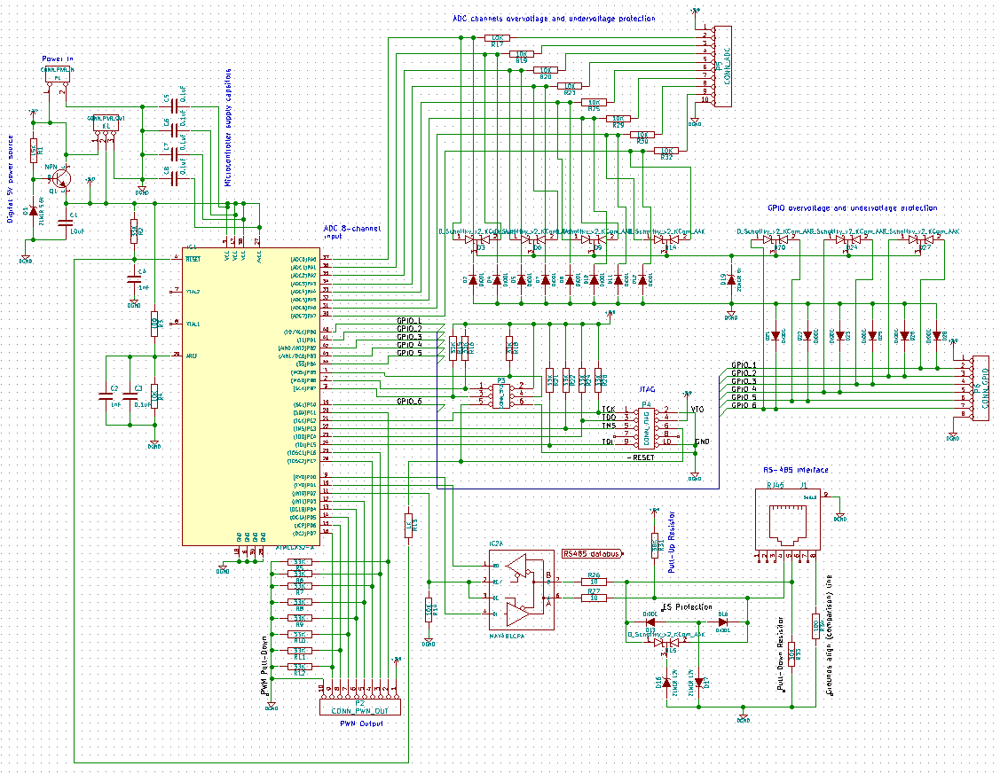

# plc_controller_mega32l

PLC controller hardware PCB scheme. ATMega32L, RS485 industrial bus interface, 8 ADC inputs, 8 PWM out, 6 GPIO

KiCAD 5.1 project.

Status: Alpha

**Features:**

- Discrete diode protection for high & low overvoltage for all input & interface contacs.

- Two types of RS485 input connectors (1*RJ-45, 3*RJ-11).

- Output RS485 RJ-11 connectors. The controller can act as connection hub on RS485 network with tree-like topology. Up to 3 output connections.

- Up to 2 Mbps RS485 bus speed. 

- JTAG debug interface.

- 5 to 25V power supply.

